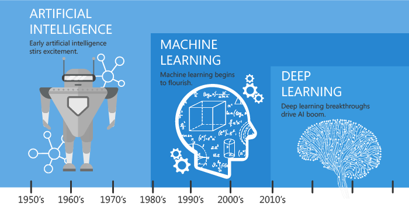

```{r setup, include=FALSE}
knitr::opts_chunk$set(echo = FALSE)
```

# Inteligencia Artificial

## Inteligencia Artificial

* Es la inteligencia llevada a cabo por máquina
* máquina imita las funciones «cognitivas» que los humanos asocian con otras mentes humanas, como por ejemplo: *percibir*, *razonar*, *aprender* y *resolver problemas*

## Aprendizaje automático

Rama de la inteligencia artificial, cuyo objetivo es desarrollar técnicas que permitan que las computadoras aprendan

## Límites de la Inteligencia artificial

### *Strong AI*
* Computadoras *pensando* a nivel humano
* Pensamiento abstracto
* **no hay evidencia de que estemos cerca de este punto**

### *Weak AI*
* Computadoras resuelven problemas detectando patrones
* **Es el modo dominante al día de hoy**

## En el tiempo


# Áreas de aplicacion


# Tecnología

## Cómputo: Ley de Moore


## Almacenamiento


